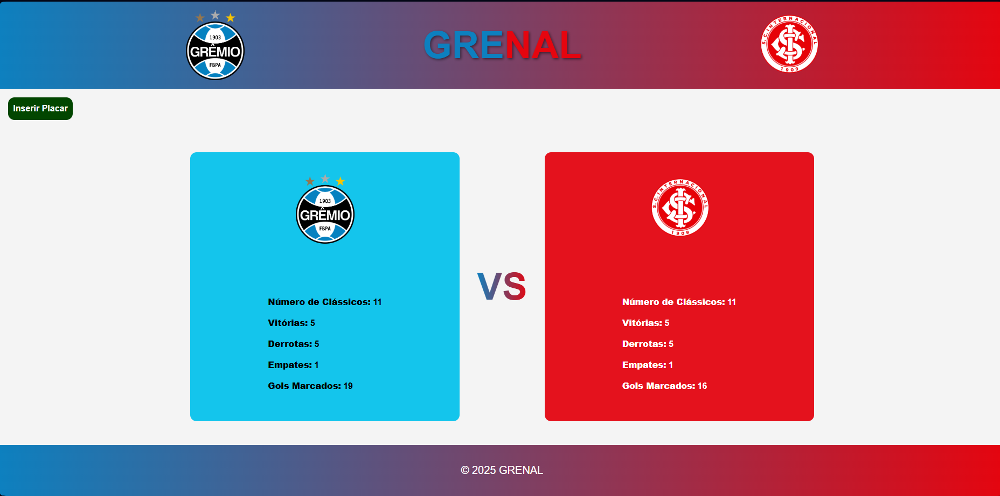
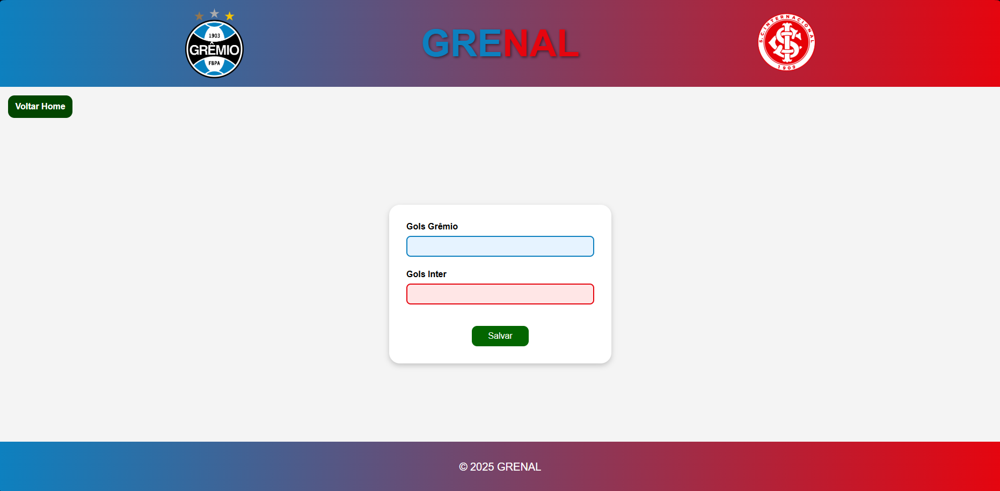

<h1 align="center" style="font-weight: bold;">GreNal ⚽</h1>

<p align="center">
 <a href="#sobre">Sobre</a> • 
 <a href="#tecnologias">Tecnologias</a> • 
 <a href="#como-rodar">Como Rodar</a> • 
 <a href="#preview">Preview</a>
</p>

<p align="center">
    <b>Aplicação web desenvolvida em PHP (MVC) com MySQL e JavaScript, que registra e exibe os resultados do clássico Grêmio x Internacional. O usuário pode inserir os placares das partidas, e o sistema atualiza automaticamente as estatísticas gerais — como número de jogos, vitórias, empates e gols marcados por cada time.</b>
</p>

---

<h2 id="sobre">📋 Sobre o Projeto</h2>

O **GreNal** é uma aplicação web interativa que permite registrar e acompanhar o histórico dos confrontos entre **Grêmio** e **Internacional**, os maiores clubes do Rio Grande do Sul.  
O sistema utiliza **PHP com padrão MVC** e **MySQL** para armazenar os resultados, e **JavaScript (Fetch API)** para atualizar as estatísticas em tempo real sem recarregar a página.  

---

<h2 id="tecnologias">💻 Tecnologias</h2>

<div>
  
  <span>HTML5</span>
</div>
<div>
  
  <span>CSS3</span>
</div>
<div>
  
  <span>JavaScript (Fetch API)</span>
</div>
<div>
  
  <span>PHP 8+ (MVC)</span>
</div>
<div>
  
  <span>MySQL</span>
</div>

---

<h2 id="como-rodar">🚀 Como Rodar</h2>

1️⃣ **Clone o repositório**  
```bash
git clone https://github.com/Dieegoo13/GreNal.git
````
<h2 id="preview">📸 Preview do Projeto</h2>




